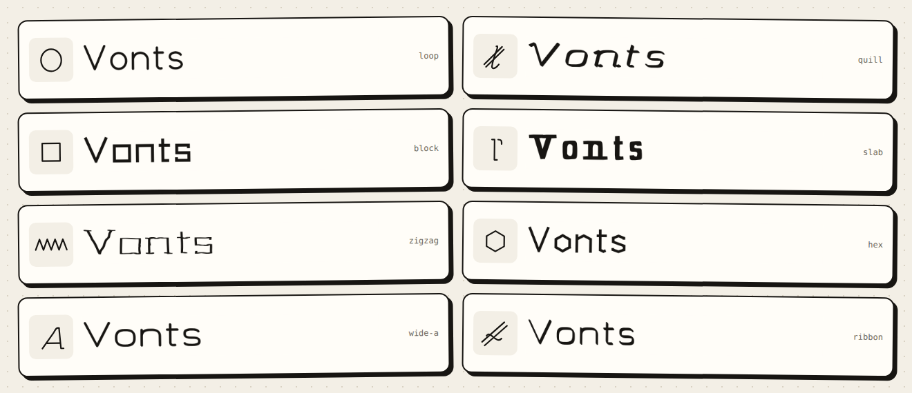
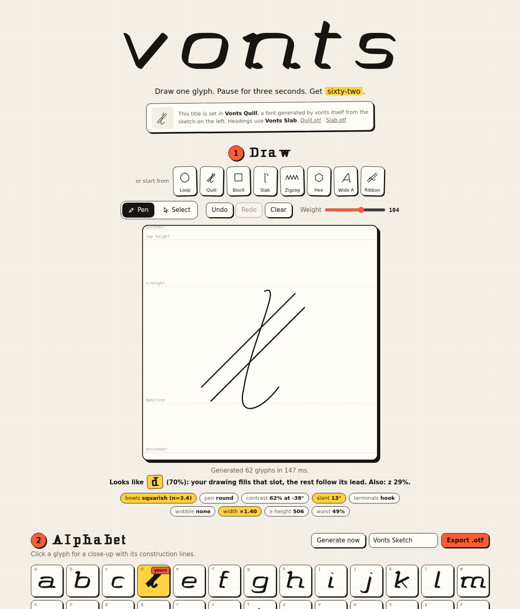
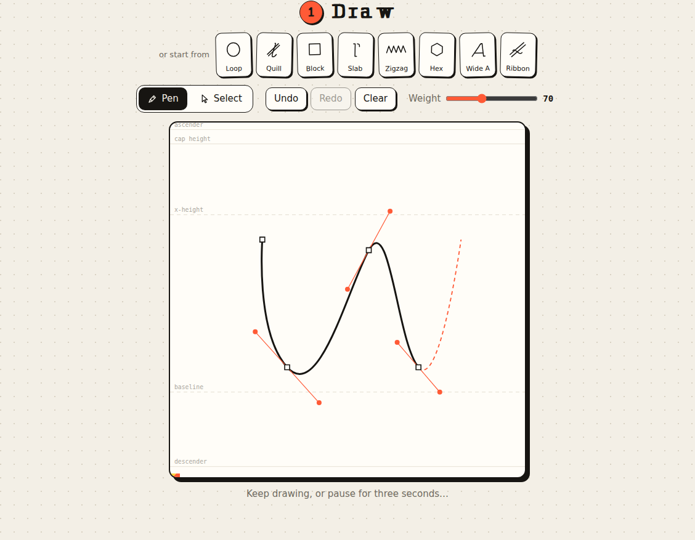
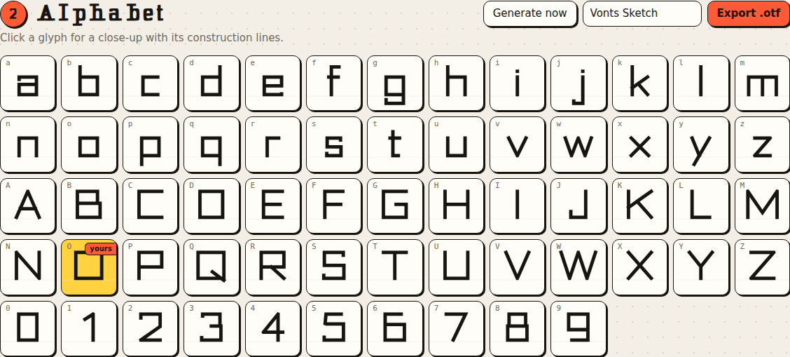
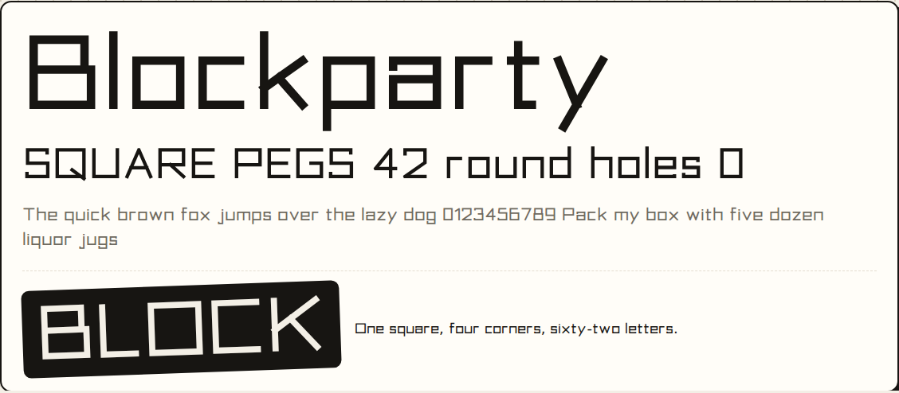
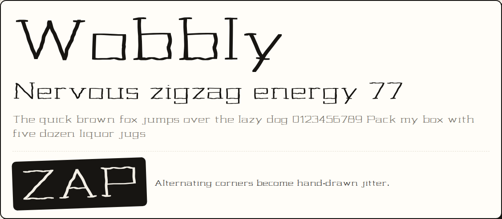
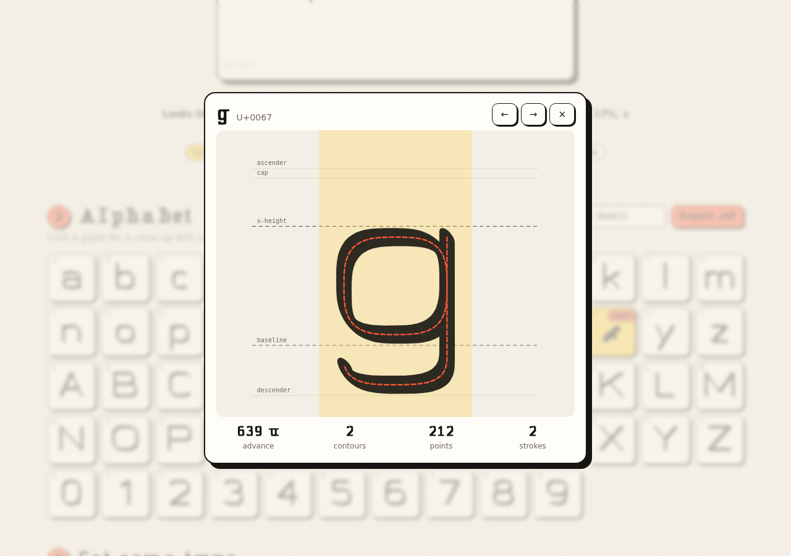
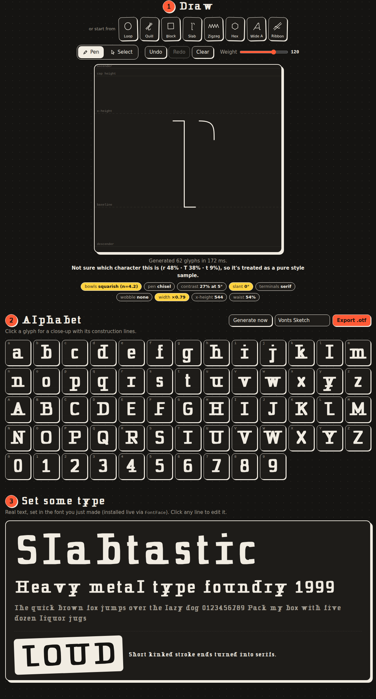
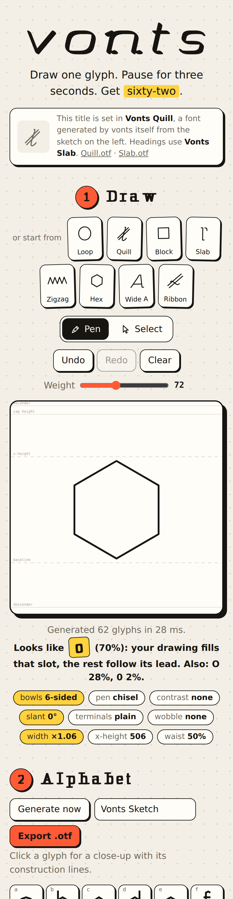

# vonts

**Draw one glyph. Pause for three seconds. Get sixty-two.**

vonts is a small browser app with an Illustrator-style pen tool. Draw a letter, a mark or a squiggle on the sketch pad. When you stop for three seconds, the app generates a matching `a–z A–Z 0–9` alphabet from your drawing. You can then export it as an `.otf` font.

Everything runs in the browser, with no server and no network calls after the page loads.



The **vonts** masthead is set in *Vonts Quill*, and the section headings in *Vonts Slab*. Both are `.otf` files that vonts generated from its own preset sketches (`npm run build:fonts`), so the page's typography is made with the page itself.

## Screenshots

| | |
| --- | --- |
|  |  |
| **Quill:** three strokes become a hooked, high-contrast italic. The drawing is recognized as a “d” and fills that slot. | **Pen tool:** Illustrator-style anchors, handles and a live rubber band. |
|  |  |
| **Block:** one square, four corners, sixty-two letters. | **Live specimen:** editable text set in the generated font through `FontFace`. |
|  |  |
| **Zigzag:** alternating corners turn into hand-drawn jitter. | **Inspector:** click any glyph to see its outline, centerline strokes, metrics and advance. |
|  |  |
| **Slab (dark mode):** short kinked stroke ends become serifs. | **Hex on a phone:** a hexagon becomes a six-sided alphabet. |

Regenerate them with `npm run screenshots`.

## Using it

| Action | How |
| --- | --- |
| Corner point | Pen (<kbd>P</kbd>): click |
| Smooth point (curve) | Pen: click and drag to pull out symmetric handles |
| Cusp (break the handle while placing) | Pen: <kbd>Alt</kbd> + drag |
| Retract the last out-handle | Pen: click the last point again |
| Close a path | Pen: click the first point |
| Finish an open path | <kbd>Enter</kbd>, <kbd>Esc</kbd> or double-click |
| Continue an open path | Pen: click one of its end points |
| Move points, handles, whole paths | Select (<kbd>A</kbd> / <kbd>V</kbd>): drag |
| Toggle smooth / corner | Select: <kbd>Alt</kbd> + click a point |
| Break handle symmetry | Select: <kbd>Alt</kbd> + drag a handle |
| Delete point / path | Select, then <kbd>Delete</kbd> / <kbd>Backspace</kbd> |
| Undo / redo | <kbd>Ctrl/⌘</kbd>+<kbd>Z</kbd>, <kbd>Shift</kbd>+<kbd>Ctrl/⌘</kbd>+<kbd>Z</kbd> |

The generator runs 3 seconds after your last edit. A striped bar under the pad counts down, and **Generate now** skips the wait. The **Weight** slider regenerates right away.

- **Presets:** the strip above the pad loads example sketches (Loop, Quill, Block, Slab, Zigzag, Hex, Wide A, Ribbon) and generates immediately.
- **Inspector:** click a glyph for a close-up with metric lines, the centerline strokes it was built from, and its advance width. Step through glyphs with ← / →.
- **Live specimen:** every generation is installed as a real web font through the `FontFace` API. The waterfall under the grid is editable text in that font: click a line and type.
- **Export:** give the font a name and click **Export .otf**.

## How it works

```
sketch (Bézier paths)
   ├─► feature extraction ──► style parameters ─┐
   └─► tiny MLP classifier ──► "looks like a" ──┤
                                                 ▼
        62 parametric skeletons ─► terminals, wobble, slant ─► nib-stroked outlines ─► grid / specimen / OTF
```

All generation runs in a Web Worker (`src/worker.ts`) so drawing never stutters. A full alphabet takes roughly 30–150 ms.

### 1. Reading the drawing (`src/style/features.ts`)

The drawing is treated as a **style sample**, not as a shape to copy. The app measures it and turns the measurements into style parameters:

| Measured in the sketch | Becomes |
| --- | --- |
| Share of curved vs. straight ink | Smooth bowls, or bowls built from facets (square → 4-sided, hexagonal, …) |
| Handle length relative to chord ("tension") | Superellipse exponent: pointed ↔ round ↔ squarish bowls |
| Sharp corners at junctions | Round pen or chisel (square) pen |
| Median corner angle | Number of facets |
| Lean of near-vertical strokes | Italic angle |
| Dominant stroke direction and how dominant it is | Nib angle and thick/thin contrast (broad-nib calligraphy) |
| Alternating zig-zag turns | Hand-drawn wobble |
| Short kinked ends / curled ends | Serifs / hooks |
| Vertical balance of the ink | Crossbar and lobe height ("waist") |
| Aspect ratio | Width and x-height |

These mappings are deliberate design heuristics, not learned ones. They're easy to read and tweak in `featuresToStyle`.

### 2. Recognizing the drawing (`src/classifier/`)

A tiny dependency-free neural network, a 403→128→62 perceptron, guesses which character you drew. Its input is a 20×20 anti-aliased raster of the ink plus three shape statistics. The weights ship int8-quantized in `weights.json` (80 KB), and inference takes microseconds.

It was trained offline by `scripts/train-classifier.ts` on **synthetic data**: the app's own 62 skeletons rendered in thousands of random styles, with random slant, wobble, facets, affine distortion and misaligned strokes. On held-out synthetic glyphs it scores ~89% top-1 and ~100% top-3. The misses are mostly genuinely ambiguous shapes like `o/O/0` and `l/I/1`.

When the classifier is at least 50% confident, two things happen:

- Your drawing itself becomes that glyph. It's scaled to the letter's height and stroked with the same pen, and marked *drawn* in the grid.
- The whole family's width is adjusted by comparing your letter's proportions with the skeleton's.

Below 50%, the drawing counts as a pure style sample.

I chose this over a generative font model on purpose. The small open font-generation models are still too large or too fragile to run well in a browser tab, while a classifier plus a parametric system is instant, deterministic and testable.

### 3. Building glyphs (`src/glyphs/`)

Each character is a function that draws **centerline strokes** from lines and superellipse arcs (`skeletons.ts`). It uses metric landmarks (baseline, x-height, cap height, ascender, descender) and base widths. Because the style parameters feed into this construction, they change the letter's structure, not just its outline. After that, `build.ts` adds serifs or hooks where vertical strokes meet a metric line, a seeded wobble, and slant.

### 4. Stroking (`src/render/outline.ts`)

Centerlines are expanded into filled outlines with [Clipper](https://github.com/junmer/clipper-lib), and all strokes are merged into one outline:

- **Round monoline pen:** round offset.
- **Elliptical calligraphic nib:** an elliptical nib is a disk under a linear map `A`, and Minkowski sums commute with linear maps. So the path is mapped by `A⁻¹`, offset round, then mapped back by `A`. This gives an exact result about 10× faster than a Minkowski sum.
- **Chisel nib:** a Minkowski sum with a rotated rectangle.

Outer contours come out counter-clockwise and counters clockwise, as font rasterizers expect.

### 5. OTF export (`src/export/otf.ts`)

The outlines are packed into a CFF-flavored OpenType font with [opentype.js](https://github.com/opentypejs/opentype.js): `.notdef`, `space` and the 62 glyphs, 1000 units per em. The e2e suite loads the exported file into Chromium's `FontFace`. Chromium sanitizes fonts with OTS, so a successful load means the file is well-formed.

## Development

Requires Node 20+.

```sh
npm install
npm run dev          # http://localhost:5173
npm test             # unit tests (Vitest)
npm run test:e2e     # end-to-end tests (Playwright, builds + previews the app)
npm run typecheck
npm run build        # static site in dist/
npm run train:model  # retrain the classifier (~2 min), writes src/classifier/weights.json
npm run build:fonts  # regenerate the house fonts (Vonts Quill / Vonts Slab) from their preset sketches
npm run screenshots  # rebuild and recapture screenshots/
```

Dev helpers:

```sh
# Render every glyph for one or more styles to an SVG contact sheet
npx tsx scripts/contact-sheet.ts sheet.svg '{}' '{"slant":12,"contrast":0.6}' '{"facets":4,"nibShape":"square"}'
node scripts/svg-to-png.mjs sheet.svg sheet.png
```

In the browser console, `window.vonts` exposes `loadSketch(doc)`, `loadPreset(id)`, `sketch`, `result` and `generateNow()`.

Run `npm run train:model` again whenever you change the skeletons, so the classifier keeps matching them. Also run `npm run build:fonts` so the house fonts pick up the change.

### Project layout

```
src/
  sketch/       document model, undo history, pen/select tool controller (DOM-free), pad metrics, presets
  style/        sketch → features → style parameters
  glyphs/       charset, style params, stroke pen, 62 skeletons, decorations, glyph assembly
  render/       stroke → outline expansion (Clipper)
  classifier/   rasterizer, MLP (inference + training), synthetic data, bundled weights
  export/       OpenType export
  ui/           sketch pad view, glyph grid, inspector, live FontFace specimen, thumbnails
  assets/fonts/ the house fonts, generated by vonts itself
  generator.ts  the pipeline;  worker.ts / engine.ts  off-main-thread execution
  idle.ts       the 3-second idle trigger
tests/unit/     Vitest: geometry, tools, features, glyphs, outlines, classifier, generator, OTF, presets
tests/e2e/      Playwright: drawing, idle generation, recognition, export, weight, undo, select, presets, inspector, house fonts
scripts/        classifier training, house fonts, screenshots, contact sheets
screenshots/    README screenshots
```

## Deployment (GitHub Pages)

`.github/workflows/pages.yml` builds and deploys `dist/` on every push to `main`. To turn it on, go to **Settings → Pages → Build and deployment → Source** and select **GitHub Actions**. The build uses relative asset paths, so it also works from a project sub-path.

`.github/workflows/ci.yml` runs the typecheck, unit tests and e2e tests on pushes and pull requests.

## Limitations

- **The style mappings are heuristics.** They read a drawing's geometry, not its intent. What they miss: a drawing's *meaning* (a sketch of a cat won't give you cat-themed letters) and the optical corrections a type designer would make, such as overshoot, stroke-weight compensation and spacing tuned per pair.
- **Recognition is case- and look-alike-blind.** Once the drawing is normalized, `o/O/0` and `l/I/1` look the same. The classifier has also only seen synthetic letters, so unusual handwriting may be read as a style sample instead.
- **The exported font is minimal:** no kerning, no hinting, no punctuation beyond the space. Outlines are polygons, which render fine but make files larger than hand-drawn Béziers would.
